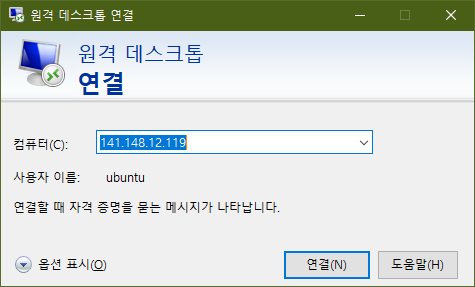
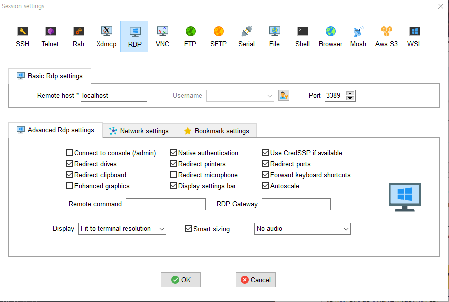
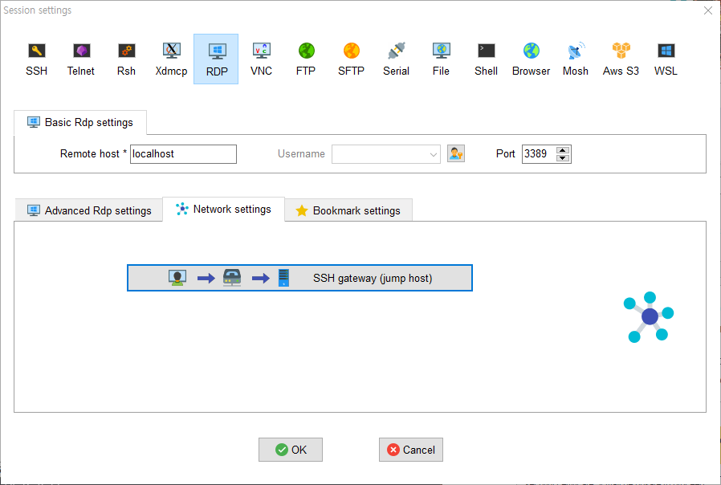
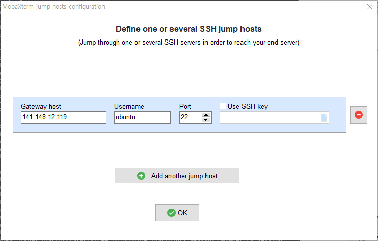
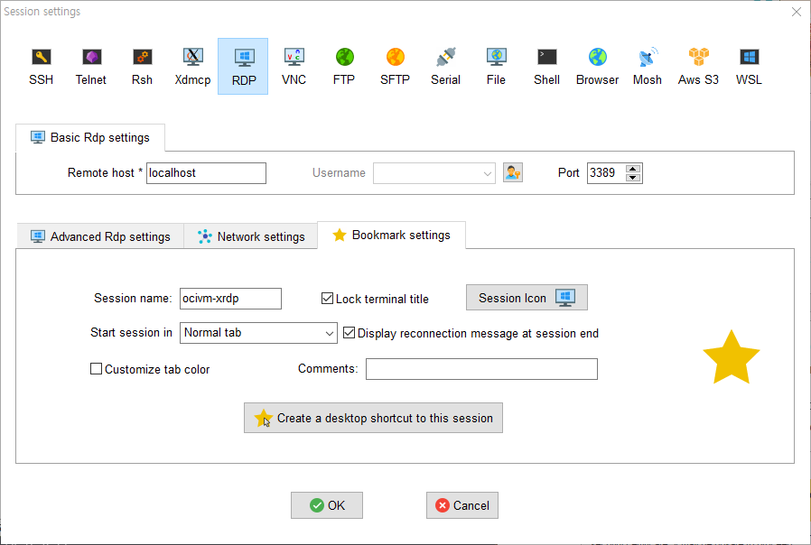
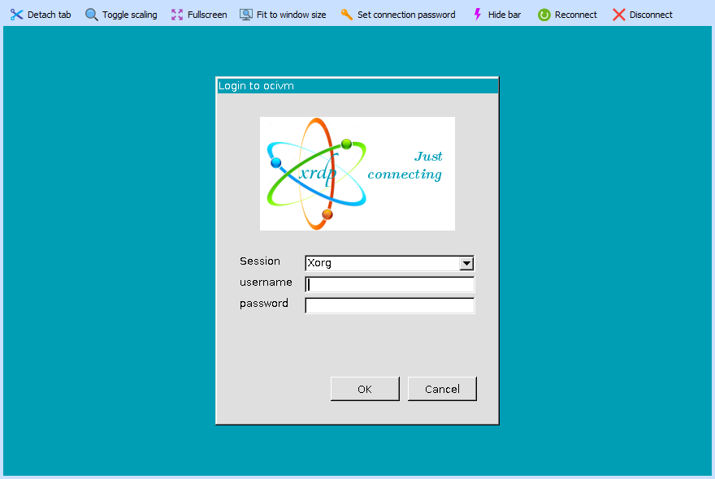
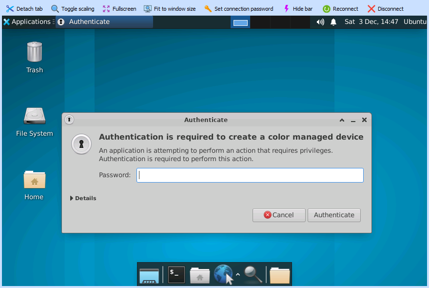
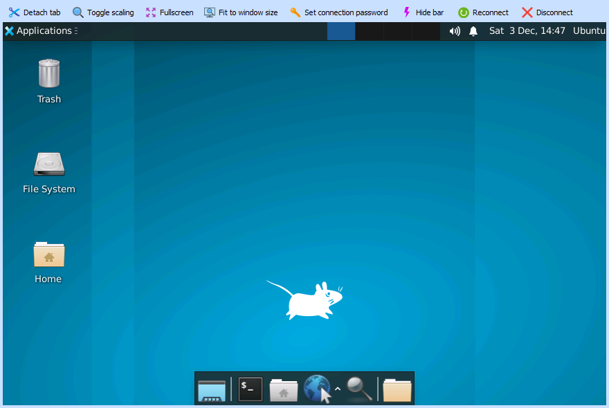
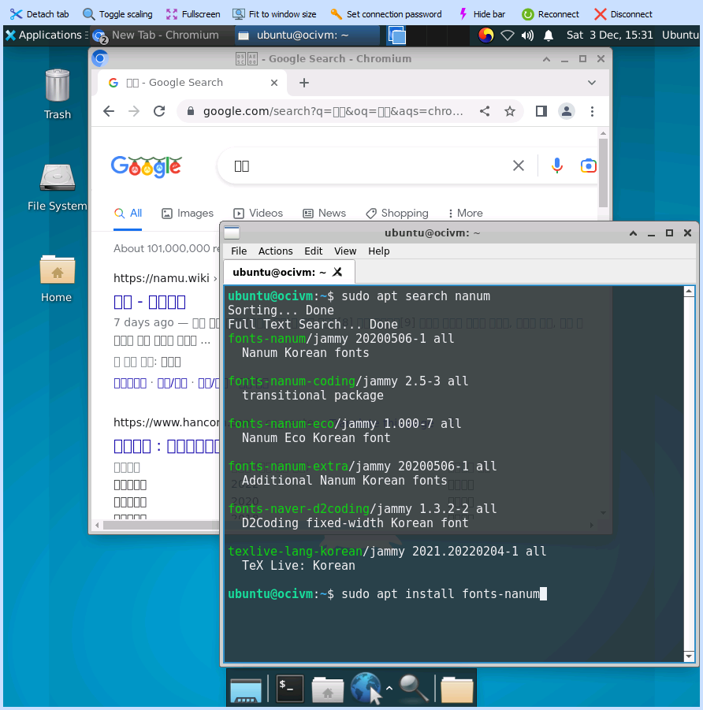
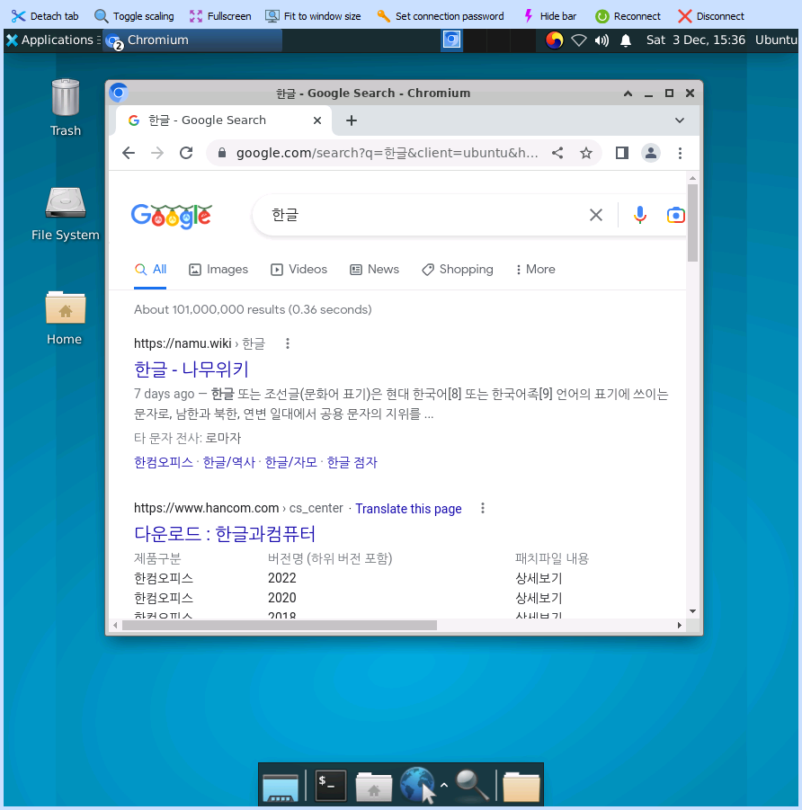

# Ubuntu 22.04/20.04에 xRDP(Remote Desktop) 설치하기

## 목표

- Ubuntu 20.04 또는 20.04 서버에 xRDP를 설치하고,   
- 여기에 데스크탑 환경(GUI)을 설치하고,    
- MobaXterm으로 원격 시스템에 연결하고,    
- 한글 입력, 출력을 할 수 있게 설정합니다.

## 1. Ubuntu 22.04/20.04에 xRDP 설치

```sh
$sudo apt update
```

install xRDP
```sh
$sudo apt -y install xrdp
```

Start xRD
```sh
$sudo systemctl status --no-install-recommends xrdp
● xrdp.service - xrdp daemon
     Loaded: loaded (/lib/systemd/system/xrdp.service; enabled; vendor preset: enabled)
     Active: active (running) since Sat 2022-12-03 14:17:09 KST; 6min ago
       Docs: man:xrdp(8)
             man:xrdp.ini(5)
    Process: 1102 ExecStartPre=/bin/sh /usr/share/xrdp/socksetup (code=exited, status=0/SUCCESS)
    Process: 1128 ExecStart=/usr/sbin/xrdp $XRDP_OPTIONS (code=exited, status=0/SUCCESS)
   Main PID: 1135 (xrdp)
      Tasks: 1 (limit: 28701)
     Memory: 1.7M
        CPU: 33ms
     CGroup: /system.slice/xrdp.service
             └─1135 /usr/sbin/xrdp

Dec 03 14:17:08 ocivm systemd[1]: Starting xrdp daemon...
Dec 03 14:17:08 ocivm xrdp[1128]: [INFO ] address [0.0.0.0] port [3389] mode 4
Dec 03 14:17:08 ocivm xrdp[1128]: [INFO ] listening to port 3389 on 0.0.0.0
Dec 03 14:17:08 ocivm xrdp[1128]: [INFO ] xrdp_listen_pp done
Dec 03 14:17:08 ocivm systemd[1]: xrdp.service: Can't open PID file /run/xrdp/xrdp.pid (yet?) a>
Dec 03 14:17:09 ocivm systemd[1]: Started xrdp daemon.
Dec 03 14:17:10 ocivm xrdp[1135]: [INFO ] starting xrdp with pid 1135
Dec 03 14:17:10 ocivm xrdp[1135]: [INFO ] address [0.0.0.0] port [3389] mode 4
Dec 03 14:17:10 ocivm xrdp[1135]: [INFO ] listening to port 3389 on 0.0.0.0
Dec 03 14:17:10 ocivm xrdp[1135]: [INFO ] xrdp_listen_pp done
```

```sh
$sudo adduser xrdp ssl-cert
```

```sh
$sudo apt install xorgxrdp
```

```sh
$sudo systemctl restart xrdp
```

## 2. xRDP 설정

```sh
$sudo vi /etc/xrdp/xrdp.ini
```

```code
port=tcp://:3389
```

## 3. 데스크탑 환경 Desktop Environment 설치

### XFCE 설치

```sh
$sudo apt install xfce4
```

```sh
$sudo apt install lightdm
```

```sh
$echo xfce4-session >~/.xsession
```

```sh
$sudo apt install xserver-xorg-input-all
```

```
$sudo service xrdp restart
```


## 4. Remte Desktop 연결

### Windows


### MobaXterm















## 5. 한글 설정

### ibus-hangul

```sh
$sudo apt install ibus-hangul
```

```sh
$ vi ~/.xprofile
```

```code
export GTK_IM_MODULE="ibus"
export QT4_IM_MODULE="ibus"
export QT_IM_MODULE="ibus"
export XMODIFIERS="@im=ibus"
ibus-daemon -drx
```

```sh
$gsettings set org.freedesktop.ibus.general engines-order "['hangul', 'xkb:kr:kr104:kor']"
$gsettings set org.freedesktop.ibus.general preload-engines "['hangul']"
```



```sh
$sudo apt install fonts-nanum
$sudo reboot
```



# 참고링크
- How to Install & Use xRDP (Remote Desktop) on Ubuntu 22.04|20.04: https://bytexd.com/xrdp-ubuntu/
- How to Install and Configure VNC on Ubuntu 22.04 : https://www.digitalocean.com/community/tutorials/how-to-install-and-configure-vnc-on-ubuntu-22-04
- 우분투 또는 우분투 서버에 RDP로 원격 연결 사용하기 : https://www.bearpooh.com/98
- xfce4 한글 설정 방법입니다 : https://www.clien.net/service/board/cm_linux/16641914
- Ubuntu 22.04 한글설정 (chrome 안 되는 문제 포함) : https://jongsky.tistory.com/8
- 라즈베리파이 한글폰트 설치하기 : https://majg.tistory.com/5
